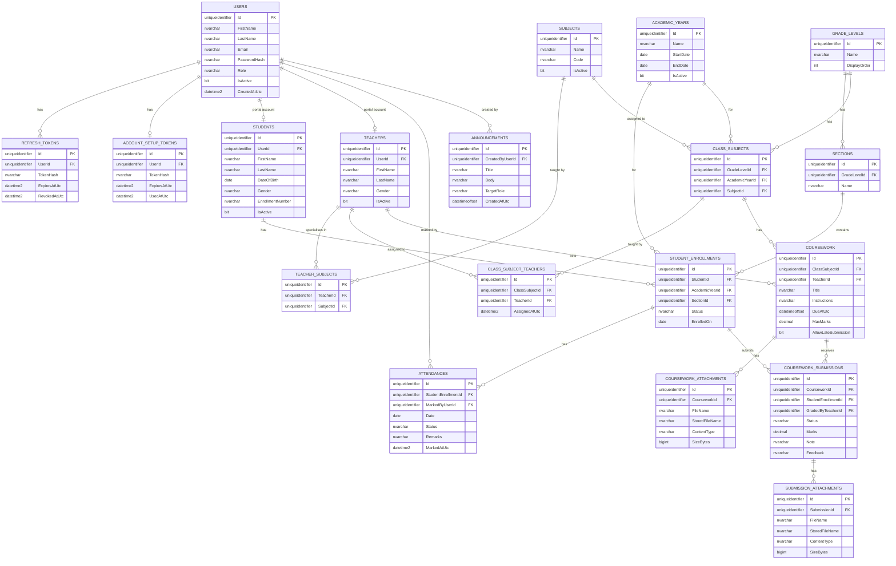

# School Management System — Complete Database Documentation

---

## Table of Contents

1. [Database Technology](#1-database-technology)
2. [Complete Table Reference](#2-complete-table-reference)
3. [Relationship Map](#3-relationship-map)
4. [ER Diagram Generation Specification](#4-er-diagram-generation-specification)
5. [Mermaid ER Diagram](#5-mermaid-er-diagram)
6. [SQL Concepts Applied to This Project](#6-sql-concepts-applied-to-this-project)
7. [Performance Analysis](#7-performance-analysis)

---

## 1. Database Technology

- **Database:** SQL Server
- **ORM:** Entity Framework Core with `IEntityTypeConfiguration<T>` per entity
- **Configuration discovery:** `modelBuilder.ApplyConfigurationsFromAssembly(typeof(AppDbContext).Assembly)` — every class implementing `IEntityTypeConfiguration<T>` in the Infrastructure assembly is automatically applied.
- **DbContext:** `AppDbContext` (`Infrastructure/SqlRepo/Persistence/AppDbContext.cs`)
- **Connection string key:** `DefaultConnection` (from `appsettings.json`)

---

## 2. Complete Table Reference

---

### Users

**Entity:** `Domain/Entities/User.cs`  
**Configuration:** `Infrastructure/SqlRepo/Persistence/Configurations/UserConfiguration.cs`  
**Business meaning:** Every person with login access — Admins, Teachers, Students. The central authentication record.

| Column | Type | Nullable | Notes |
|--------|------|----------|-------|
| Id | uniqueidentifier | NOT NULL | PK, GUID |
| FirstName | nvarchar | NOT NULL | max length defined in configuration |
| LastName | nvarchar | NOT NULL | |
| Email | nvarchar | NOT NULL | UNIQUE constraint |
| PasswordHash | nvarchar | NOT NULL | BCrypt hash |
| Role | nvarchar | NOT NULL | Stored as string: "Admin", "Teacher", "Student" |
| IsActive | bit | NOT NULL | false = cannot log in |
| CreatedAtUtc | datetime2 | NOT NULL | |
| UpdatedAtUtc | datetime2 | NULL | |

**Unique constraints:** Email is unique.

**Indexes:** Email (for login lookup).

**Relationships:**
- `Users.Id` ← `Students.UserId` (0..1, optional — student may not have portal access)
- `Users.Id` ← `Teachers.UserId` (0..1, optional)
- `Users.Id` ← `RefreshTokens.UserId` (1 → many)
- `Users.Id` ← `AccountSetupTokens.UserId` (1 → 1)
- `Users.Id` ← `Attendances.MarkedByUserId` (many → 1, audit FK, no nav property)
- `Users.Id` ← `Announcements.CreatedByUserId` (many → 1, audit FK)

**Used by:** `IUserRepository`, `UserRepository`  
**API endpoints:** All auth endpoints  
**Frontend features:** Login, GetMe, activate account

---

### RefreshTokens

**Entity:** `Domain/Entities/RefreshToken.cs`  
**Configuration:** `Infrastructure/SqlRepo/Persistence/Configurations/RefreshTokenConfiguration.cs`  
**Business meaning:** Stores hashed refresh tokens for token rotation. The raw token never touches the database.

| Column | Type | Nullable | Notes |
|--------|------|----------|-------|
| Id | uniqueidentifier | NOT NULL | PK |
| UserId | uniqueidentifier | NOT NULL | FK → Users.Id |
| TokenHash | nvarchar | NOT NULL | SHA256 hex of raw token |
| ExpiresAtUtc | datetime2 | NOT NULL | |
| RevokedAtUtc | datetime2 | NULL | Set when rotated or on logout |
| ReplacedByTokenHash | nvarchar | NULL | Set when rotated |
| CreatedAtUtc | datetime2 | NOT NULL | |

**Computed property (not a column):** `IsActive` = `RevokedAtUtc is null && ExpiresAtUtc > UtcNow`

**Delete behavior:** Restrict (Users cannot be deleted while refresh tokens exist)

**Used by:** `IRefreshTokenRepository`, `RefreshTokenRepository`  
**API endpoints:** POST /auth/login, POST /auth/refresh, POST /auth/logout

---

### AccountSetupTokens

**Entity:** `Domain/Entities/AccountSetupToken.cs`  
**Configuration:** `Infrastructure/SqlRepo/Persistence/Configurations/AccountSetupConfigurationToken.cs`  
**Business meaning:** One-time token sent by email when a student/teacher is invited to the portal. Verifies identity without requiring an existing password.

| Column | Type | Nullable | Notes |
|--------|------|----------|-------|
| Id | uniqueidentifier | NOT NULL | PK |
| UserId | uniqueidentifier | NOT NULL | FK → Users.Id |
| TokenHash | nvarchar | NOT NULL | SHA256 of raw token |
| ExpiresAtUtc | datetime2 | NOT NULL | |
| UsedAtUtc | datetime2 | NULL | Set when activated |
| CreatedAtUtc | datetime2 | NOT NULL | |

**Delete behavior:** Restrict

**Used by:** `IAccountSetupTokenRepository`  
**API endpoints:** POST /auth/activate, POST /students/{id}/invite, POST /teachers/{id}/invite

---

### Students

**Entity:** `Domain/Entities/Student.cs`  
**Configuration:** `Infrastructure/SqlRepo/Persistence/Configurations/StudentConfiguration.cs`  
**Business meaning:** A student record exists independently of portal access. They can exist without a User account (invited later).

| Column | Type | Nullable | Notes |
|--------|------|----------|-------|
| Id | uniqueidentifier | NOT NULL | PK |
| UserId | uniqueidentifier | NULL | FK → Users.Id (optional) |
| FirstName | nvarchar | NOT NULL | |
| LastName | nvarchar | NOT NULL | |
| DateOfBirth | date | NOT NULL | |
| Gender | nvarchar | NOT NULL | Stored as string |
| EnrollmentNumber | nvarchar | NOT NULL | UNIQUE |
| IsActive | bit | NOT NULL | |
| CreatedAtUtc | datetime2 | NOT NULL | |
| UpdatedAtUtc | datetime2 | NULL | |

**Unique constraints:** EnrollmentNumber.

**Indexes:** EnrollmentNumber (for search queries).

**Relationships:**
- `Students.UserId` → `Users.Id` (optional, nullable FK)
- `Students.Id` ← `StudentEnrollments.StudentId` (1 → many)

**Used by:** `IStudentRepository`, `StudentRepository`  
**API endpoints:** All /api/students/* endpoints  
**Frontend features:** Students page, student details page, student portal

---

### Teachers

**Entity:** `Domain/Entities/Teacher.cs`  
**Configuration:** `Infrastructure/SqlRepo/Persistence/Configurations/TeacherConfiguration.cs`  
**Business meaning:** A teacher record, optionally linked to a User for portal access.

| Column | Type | Nullable | Notes |
|--------|------|----------|-------|
| Id | uniqueidentifier | NOT NULL | PK |
| UserId | uniqueidentifier | NULL | FK → Users.Id |
| FirstName | nvarchar | NOT NULL | |
| LastName | nvarchar | NOT NULL | |
| Gender | nvarchar | NOT NULL | |
| IsActive | bit | NOT NULL | |
| CreatedAtUtc | datetime2 | NOT NULL | |
| UpdatedAtUtc | datetime2 | NULL | |

**Relationships:**
- `Teachers.UserId` → `Users.Id`
- `Teachers.Id` ← `TeacherSubjects.TeacherId` (1 → many)
- `Teachers.Id` ← `ClassSubjectTeachers.TeacherId` (1 → many)
- `Teachers.Id` ← `CourseWork.TeacherId` (1 → many)

**Used by:** `ITeacherRepository`, `TeacherRepository`  
**API endpoints:** All /api/teachers/* endpoints  
**Frontend features:** Teachers page, teacher details, teacher portal

---

### AcademicYears

**Entity:** `Domain/Entities/AcademicYear.cs`  
**Configuration:** `Infrastructure/SqlRepo/Persistence/Configurations/AcademicYearConfiguration.cs`  
**Business meaning:** A school year (e.g., 2025–2026). Only one can be active at a time. Controls which year is used for enrollments, coursework, and reporting.

| Column | Type | Nullable | Notes |
|--------|------|----------|-------|
| Id | uniqueidentifier | NOT NULL | PK |
| Name | nvarchar | NOT NULL | e.g., "2025-2026" |
| StartDate | date | NOT NULL | |
| EndDate | date | NOT NULL | |
| IsActive | bit | NOT NULL | Only one should be true at once (enforced in service) |
| CreatedAtUtc | datetime2 | NOT NULL | |
| UpdatedAtUtc | datetime2 | NULL | |

**Relationships:**
- `AcademicYears.Id` ← `StudentEnrollments.AcademicYearId` (1 → many)
- `AcademicYears.Id` ← `ClassSubjects.AcademicYearId` (1 → many)

**Used by:** `IAcademicYearRepository`, `AcademicYearRepository`  
**API endpoints:** All /api/academic-years/* endpoints

---

### GradeLevels

**Entity:** `Domain/Entities/GradeLevel.cs`  
**Configuration:** `Infrastructure/SqlRepo/Persistence/Configurations/GradeLevelConfiguration.cs`  
**Business meaning:** A grade or year in school (e.g., Grade 1, Grade 10). Contains sections.

| Column | Type | Nullable | Notes |
|--------|------|----------|-------|
| Id | uniqueidentifier | NOT NULL | PK |
| Name | nvarchar | NOT NULL | |
| DisplayOrder | int | NOT NULL | For sorting in UI |
| CreatedAtUtc | datetime2 | NOT NULL | |

**Relationships:**
- `GradeLevels.Id` ← `Sections.GradeLevelId` (1 → many)
- `GradeLevels.Id` ← `ClassSubjects.GradeLevelId` (1 → many)

**Used by:** `IGradeLevelRepository`, `GradeLevelRepository`  
**API endpoints:** All /api/grade-levels/* endpoints

---

### Sections

**Entity:** `Domain/Entities/Section.cs`  
**Configuration:** `Infrastructure/SqlRepo/Persistence/Configurations/SectionConfiguration.cs`  
**Business meaning:** A class section within a grade level (e.g., Grade 10 - Section A). Students are enrolled into sections.

| Column | Type | Nullable | Notes |
|--------|------|----------|-------|
| Id | uniqueidentifier | NOT NULL | PK |
| GradeLevelId | uniqueidentifier | NOT NULL | FK → GradeLevels.Id |
| Name | nvarchar | NOT NULL | e.g., "Section A" |
| CreatedAtUtc | datetime2 | NOT NULL | |

**Relationships:**
- `Sections.GradeLevelId` → `GradeLevels.Id` (many → 1)
- `Sections.Id` ← `StudentEnrollments.SectionId` (1 → many)

**Used by:** `ISectionRepository`, `SectionRepository`  
**API endpoints:** GET/POST/PUT/DELETE /api/grade-levels/{id}/sections/*

---

### Subjects

**Entity:** `Domain/Entities/Subject.cs`  
**Configuration:** `Infrastructure/SqlRepo/Persistence/Configurations/SubjectConfiguration.cs`  
**Business meaning:** A subject in the school catalogue (e.g., Mathematics, English). Subjects can be deactivated without deletion.

| Column | Type | Nullable | Notes |
|--------|------|----------|-------|
| Id | uniqueidentifier | NOT NULL | PK |
| Name | nvarchar | NOT NULL | |
| Code | nvarchar | NOT NULL | UNIQUE |
| IsActive | bit | NOT NULL | Added in migration AddSubjectIsActive |
| CreatedAtUtc | datetime2 | NOT NULL | |
| UpdatedAtUtc | datetime2 | NULL | |

**Unique constraints:** Code.

**Relationships:**
- `Subjects.Id` ← `ClassSubjects.SubjectId` (1 → many)
- `Subjects.Id` ← `TeacherSubjects.SubjectId` (1 → many)

**Used by:** `ISubjectRepository`, `SubjectRepository`  
**API endpoints:** All /api/subjects/* endpoints

---

### ClassSubjects

**Entity:** `Domain/Entities/ClassSubject.cs`  
**Configuration:** `Infrastructure/SqlRepo/Persistence/Configurations/ClassSubjectConfiguration.cs`  
**Business meaning:** Represents a subject taught to a specific grade level in a specific academic year — the curriculum entry. Multiple teachers can be assigned per class-subject via `ClassSubjectTeachers`.

| Column | Type | Nullable | Notes |
|--------|------|----------|-------|
| Id | uniqueidentifier | NOT NULL | PK |
| GradeLevelId | uniqueidentifier | NOT NULL | FK → GradeLevels.Id |
| AcademicYearId | uniqueidentifier | NOT NULL | FK → AcademicYears.Id |
| SubjectId | uniqueidentifier | NOT NULL | FK → Subjects.Id |
| CreatedAtUtc | datetime2 | NOT NULL | |

**Composite unique constraint:** (GradeLevelId, AcademicYearId, SubjectId) — the same subject cannot be assigned twice to the same grade in the same year.

**Relationships:**
- `ClassSubjects.GradeLevelId` → `GradeLevels.Id`
- `ClassSubjects.AcademicYearId` → `AcademicYears.Id`
- `ClassSubjects.SubjectId` → `Subjects.Id`
- `ClassSubjects.Id` ← `ClassSubjectTeachers.ClassSubjectId` (1 → many)
- `ClassSubjects.Id` ← `CourseWork.ClassSubjectId` (1 → many)

**Used by:** `IClassSubjectRepository`, `ClassSubjectRepository`

---

### ClassSubjectTeachers

**Entity:** `Domain/Entities/ClassSubjectTeacher.cs`  
**Configuration:** `Infrastructure/SqlRepo/Persistence/Configurations/ClassSubjectTeacherConfiguration.cs`  
**Business meaning:** Junction table — assigns a teacher to a specific class-subject. One teacher per class-subject is enforced at the service level.

| Column | Type | Nullable | Notes |
|--------|------|----------|-------|
| Id | uniqueidentifier | NOT NULL | PK |
| ClassSubjectId | uniqueidentifier | NOT NULL | FK → ClassSubjects.Id |
| TeacherId | uniqueidentifier | NOT NULL | FK → Teachers.Id |
| AssignedAtUtc | datetime2 | NOT NULL | |

**Relationships:**
- `ClassSubjectTeachers.ClassSubjectId` → `ClassSubjects.Id`
- `ClassSubjectTeachers.TeacherId` → `Teachers.Id`

**Used by:** `IClassSubjectTeacherRepository`, `ClassSubjectTeacherRepository`

---

### TeacherSubjects

**Entity:** `Domain/Entities/TeacherSubject.cs`  
**Configuration:** `Infrastructure/SqlRepo/Persistence/Configurations/TeacherSubjectConfiguration.cs`  
**Business meaning:** Tracks which subjects a teacher specialises in — their qualifications. Separate from which class they're currently assigned to.

| Column | Type | Nullable | Notes |
|--------|------|----------|-------|
| Id | uniqueidentifier | NOT NULL | PK |
| TeacherId | uniqueidentifier | NOT NULL | FK → Teachers.Id |
| SubjectId | uniqueidentifier | NOT NULL | FK → Subjects.Id |

**Composite unique constraint:** (TeacherId, SubjectId).

**Relationships:**
- `TeacherSubjects.TeacherId` → `Teachers.Id`
- `TeacherSubjects.SubjectId` → `Subjects.Id`

**Used by:** `ITeacherSubjectRepository`, `TeacherSubjectRepository`

---

### StudentEnrollments

**Entity:** `Domain/Entities/StudentEnrollment.cs`  
**Configuration:** `Infrastructure/SqlRepo/Persistence/Configurations/StudentEnrollmentConfiguration.cs`  
**Business meaning:** Records a student's enrollment in a section for an academic year. A student has at most one enrollment per academic year (composite unique constraint). Status tracks Active, Withdrawn, Promoted, etc.

| Column | Type | Nullable | Notes |
|--------|------|----------|-------|
| Id | uniqueidentifier | NOT NULL | PK |
| StudentId | uniqueidentifier | NOT NULL | FK → Students.Id |
| AcademicYearId | uniqueidentifier | NOT NULL | FK → AcademicYears.Id |
| SectionId | uniqueidentifier | NOT NULL | FK → Sections.Id |
| Status | nvarchar | NOT NULL | EnrollmentStatus enum as string |
| EnrolledOn | date | NOT NULL | |
| CreatedAtUtc | datetime2 | NOT NULL | |
| UpdatedAtUtc | datetime2 | NULL | |

**Composite unique constraint:** (StudentId, AcademicYearId) — one enrollment per student per year.

**Indexes:**
- Unique composite: (StudentId, AcademicYearId)
- Non-unique: SectionId (for fast "who is in this section" queries)

**Delete behavior:** Restrict on all FKs.

**Relationships:**
- `StudentEnrollments.StudentId` → `Students.Id`
- `StudentEnrollments.AcademicYearId` → `AcademicYears.Id`
- `StudentEnrollments.SectionId` → `Sections.Id`
- `StudentEnrollments.Id` ← `Attendances.StudentEnrollmentId` (1 → many)

**Used by:** `IStudentEnrollmentRepository`, `StudentEnrollmentRepository`  
**API endpoints:** All enrollment endpoints, attendance endpoints (roster lookup)

---

### Attendances

**Entity:** `Domain/Entities/Attendance.cs`  
**Configuration:** `Infrastructure/SqlRepo/Persistence/Configurations/AttendanceConfiguration.cs`  
**Business meaning:** One record per student per day — the attendance status for a student in their enrolled section. Supports upsert pattern.

| Column | Type | Nullable | Notes |
|--------|------|----------|-------|
| Id | uniqueidentifier | NOT NULL | PK |
| StudentEnrollmentId | uniqueidentifier | NOT NULL | FK → StudentEnrollments.Id |
| Date | date | NOT NULL | |
| Status | nvarchar | NOT NULL | AttendanceStatus: Present, Absent, Late, Excused |
| Remarks | nvarchar | NULL | max 250 chars |
| MarkedByUserId | uniqueidentifier | NOT NULL | FK → Users.Id (audit, no nav property) |
| MarkedAtUtc | datetime2 | NOT NULL | |
| UpdatedAtUtc | datetime2 | NULL | |

**Composite unique constraint:** (StudentEnrollmentId, Date) — one attendance record per student per day. This prevents duplicate marking.

**Indexes:**
- Unique composite: (StudentEnrollmentId, Date)
- Non-unique: Date (for "get whole section for this date" queries)

**Delete behavior:** Restrict on both FKs.

**Used by:** `IAttendanceRepository`, `AttendanceRepository`  
**API endpoints:** All /api/.../attendance endpoints

---

### Announcements

**Entity:** `Domain/Entities/Announcement.cs`  
**Configuration:** `Infrastructure/SqlRepo/Persistence/Configurations/AnnouncementConfiguration.cs`  
**Business meaning:** A notice published by an admin, targeted to specific roles (All, Students, Teachers).

| Column | Type | Nullable | Notes |
|--------|------|----------|-------|
| Id | uniqueidentifier | NOT NULL | PK |
| Title | nvarchar | NOT NULL | |
| Body | nvarchar | NOT NULL | |
| TargetRole | nvarchar | NOT NULL | AnnouncementTargetRole enum as string |
| CreatedByUserId | uniqueidentifier | NOT NULL | FK → Users.Id (audit) |
| CreatedAtUtc | datetimeoffset | NOT NULL | Note: datetimeoffset, not datetime2 |
| UpdatedAtUtc | datetimeoffset | NULL | |

**Note:** Changed to `datetimeoffset` in migration `ChangedAnnouncementDatetime` to properly support time zone awareness.

**Used by:** `IAnnouncementRepository`, `AnnouncementRepository`  
**API endpoints:** All /api/announcements/* endpoints

---

### CourseWork

**Entity:** `Domain/Entities/CourseWork.cs`  
**Configuration:** `Infrastructure/SqlRepo/Persistence/Configurations/CourseWorkConfiguration.cs`  
**Business meaning:** An assignment or task set by a teacher for a class-subject.

| Column | Type | Nullable | Notes |
|--------|------|----------|-------|
| Id | uniqueidentifier | NOT NULL | PK |
| ClassSubjectId | uniqueidentifier | NOT NULL | FK → ClassSubjects.Id |
| TeacherId | uniqueidentifier | NOT NULL | FK → Teachers.Id |
| Title | nvarchar(200) | NOT NULL | |
| Instructions | nvarchar(4000) | NULL | |
| DueAtUtc | datetimeoffset | NOT NULL | |
| MaxMarks | decimal | NOT NULL | |
| AllowLateSubmission | bit | NOT NULL | |
| CreatedAtUtc | datetimeoffset | NOT NULL | |
| UpdatedAtUtc | datetimeoffset | NULL | |

**Relationships:**
- `CourseWork.ClassSubjectId` → `ClassSubjects.Id`
- `CourseWork.TeacherId` → `Teachers.Id`
- `CourseWork.Id` ← `CourseworkAttachments.CourseworkId` (1 → many)
- `CourseWork.Id` ← `CourseworkSubmissions.CourseworkId` (1 → many)

**Used by:** `ICourseWorkRepository`, `CourseworkRepository`

---

### CourseworkAttachments

**Entity:** `Domain/Entities/CourseWorkAttachment.cs`  
**Configuration:** `Infrastructure/SqlRepo/Persistence/Configurations/CourseworkAtachmentConfiguration.cs` (typo in file name)  
**Business meaning:** A file attached by a teacher to a piece of coursework (e.g., the question paper). Stored on disk; DB stores the path.

| Column | Type | Nullable | Notes |
|--------|------|----------|-------|
| Id | uniqueidentifier | NOT NULL | PK |
| CourseworkId | uniqueidentifier | NOT NULL | FK → CourseWork.Id |
| FileName | nvarchar | NOT NULL | Display name |
| StoredFileName | nvarchar | NOT NULL | Randomised name on disk |
| ContentType | nvarchar | NOT NULL | MIME type |
| SizeBytes | bigint | NOT NULL | |
| UploadedAtUtc | datetimeoffset | NOT NULL | |

**Delete behavior:** Cascade from CourseWork (if coursework is deleted, attachments are deleted).

**Physical storage:** `WebApi/Storage/coursework/{courseworkId}/{storedFileName}`

---

### CourseworkSubmissions

**Entity:** `Domain/Entities/CourseWorkSubmission.cs`  
**Configuration:** `Infrastructure/SqlRepo/Persistence/Configurations/CourseWorkSubmissionConfiguration.cs`  
**Business meaning:** A student's submission for a specific piece of coursework. One per student per coursework (unique constraint).

| Column | Type | Nullable | Notes |
|--------|------|----------|-------|
| Id | uniqueidentifier | NOT NULL | PK |
| CourseworkId | uniqueidentifier | NOT NULL | FK → CourseWork.Id |
| StudentEnrollmentId | uniqueidentifier | NOT NULL | FK → StudentEnrollments.Id |
| Note | nvarchar | NULL | Student's submission note |
| SubmittedAtUtc | datetimeoffset | NOT NULL | |
| Status | nvarchar | NOT NULL | SubmissionStatus: Pending, Submitted, Graded, Late |
| Marks | decimal | NULL | Filled in by teacher on grading |
| Feedback | nvarchar | NULL | Teacher feedback |
| GradedAtUtc | datetimeoffset | NULL | |
| GradedByTeacherId | uniqueidentifier | NULL | FK → Teachers.Id |

**Composite unique constraint:** (CourseworkId, StudentEnrollmentId) — one submission per student per assignment.

**Relationships:**
- `CourseworkSubmissions.CourseworkId` → `CourseWork.Id`
- `CourseworkSubmissions.StudentEnrollmentId` → `StudentEnrollments.Id`
- `CourseworkSubmissions.Id` ← `SubmissionAttachments.SubmissionId` (1 → many)

**Used by:** `ICourseWorkSubmissionRepository`, `CourseworkSubmissionRepository`

---

### SubmissionAttachments

**Entity:** `Domain/Entities/SubmissionAttachment.cs`  
**Configuration:** `Infrastructure/SqlRepo/Persistence/Configurations/SubmissionAttachmentConfiguration.cs`  
**Business meaning:** Files attached by a student when submitting coursework.

| Column | Type | Nullable | Notes |
|--------|------|----------|-------|
| Id | uniqueidentifier | NOT NULL | PK |
| SubmissionId | uniqueidentifier | NOT NULL | FK → CourseworkSubmissions.Id |
| FileName | nvarchar | NOT NULL | |
| StoredFileName | nvarchar | NOT NULL | |
| ContentType | nvarchar | NOT NULL | |
| SizeBytes | bigint | NOT NULL | |
| UploadedAtUtc | datetimeoffset | NOT NULL | |

**Physical storage:** `WebApi/Storage/submissions/{submissionId}/{storedFileName}`

---

## 3. Relationship Map

```
Users
  │
  ├──(UserId, optional)──► Students
  │                            │
  │                            └──(StudentId)──► StudentEnrollments
  │                                                     │
  │                                                     ├──(AcademicYearId)──► AcademicYears
  │                                                     │
  │                                                     ├──(SectionId)──► Sections
  │                                                     │                      │
  │                                                     │                      └──(GradeLevelId)──► GradeLevels
  │                                                     │
  │                                                     └──(Id)──► Attendances
  │                                                                      │
  │                                                     ◄──(MarkedByUserId)──┘
  │
  ├──(UserId, optional)──► Teachers
  │                            │
  │                            ├──(TeacherId)──► TeacherSubjects ──► Subjects
  │                            │
  │                            ├──(TeacherId)──► ClassSubjectTeachers
  │                            │                        │
  │                            │                        └──(ClassSubjectId)──► ClassSubjects
  │                            │                                                    │
  │                            │                                  ◄──(GradeLevelId)──┘
  │                            │                                  ◄──(AcademicYearId)──► AcademicYears
  │                            │                                  ◄──(SubjectId)──► Subjects
  │                            │
  │                            └──(TeacherId)──► CourseWork
  │                                                  │
  │                            ◄──(ClassSubjectId)───┘
  │                                                  │
  │                                                  ├──► CourseworkAttachments
  │                                                  │
  │                                                  └──► CourseworkSubmissions ──► StudentEnrollments
  │                                                                │
  │                                                                └──► SubmissionAttachments
  │
  └──(CreatedByUserId)──► Announcements

AccountSetupTokens ──(UserId)──► Users
RefreshTokens ──(UserId)──► Users
```

---

## 4. ER Diagram Generation Specification

This section is formatted to allow an AI image generator to create a database diagram.

```
TABLE: Users
PK: Id (uniqueidentifier)
Columns: FirstName, LastName, Email (UNIQUE), PasswordHash, Role (nvarchar), IsActive (bit), CreatedAtUtc, UpdatedAtUtc
FK: none (root table)

TABLE: Students
PK: Id (uniqueidentifier)
FK:
- UserId → Users.Id (nullable, 0..1)
Columns: FirstName, LastName, DateOfBirth, Gender, EnrollmentNumber (UNIQUE), IsActive, CreatedAtUtc, UpdatedAtUtc

TABLE: Teachers
PK: Id (uniqueidentifier)
FK:
- UserId → Users.Id (nullable, 0..1)
Columns: FirstName, LastName, Gender, IsActive, CreatedAtUtc, UpdatedAtUtc

TABLE: RefreshTokens
PK: Id (uniqueidentifier)
FK:
- UserId → Users.Id (NOT NULL)
Columns: TokenHash, ExpiresAtUtc, RevokedAtUtc, ReplacedByTokenHash, CreatedAtUtc

TABLE: AccountSetupTokens
PK: Id (uniqueidentifier)
FK:
- UserId → Users.Id (NOT NULL)
Columns: TokenHash, ExpiresAtUtc, UsedAtUtc, CreatedAtUtc

TABLE: AcademicYears
PK: Id (uniqueidentifier)
FK: none
Columns: Name, StartDate, EndDate, IsActive (bit), CreatedAtUtc, UpdatedAtUtc

TABLE: GradeLevels
PK: Id (uniqueidentifier)
FK: none
Columns: Name, DisplayOrder, CreatedAtUtc

TABLE: Sections
PK: Id (uniqueidentifier)
FK:
- GradeLevelId → GradeLevels.Id (NOT NULL)
Columns: Name, CreatedAtUtc

TABLE: Subjects
PK: Id (uniqueidentifier)
FK: none
Columns: Name, Code (UNIQUE), IsActive, CreatedAtUtc, UpdatedAtUtc

TABLE: ClassSubjects
PK: Id (uniqueidentifier)
FK:
- GradeLevelId → GradeLevels.Id (NOT NULL)
- AcademicYearId → AcademicYears.Id (NOT NULL)
- SubjectId → Subjects.Id (NOT NULL)
Columns: CreatedAtUtc
UNIQUE: (GradeLevelId, AcademicYearId, SubjectId)

TABLE: ClassSubjectTeachers
PK: Id (uniqueidentifier)
FK:
- ClassSubjectId → ClassSubjects.Id (NOT NULL)
- TeacherId → Teachers.Id (NOT NULL)
Columns: AssignedAtUtc

TABLE: TeacherSubjects
PK: Id (uniqueidentifier)
FK:
- TeacherId → Teachers.Id (NOT NULL)
- SubjectId → Subjects.Id (NOT NULL)
Columns: none additional
UNIQUE: (TeacherId, SubjectId)

TABLE: StudentEnrollments
PK: Id (uniqueidentifier)
FK:
- StudentId → Students.Id (NOT NULL)
- AcademicYearId → AcademicYears.Id (NOT NULL)
- SectionId → Sections.Id (NOT NULL)
Columns: Status, EnrolledOn, CreatedAtUtc, UpdatedAtUtc
UNIQUE: (StudentId, AcademicYearId)
INDEX: SectionId

TABLE: Attendances
PK: Id (uniqueidentifier)
FK:
- StudentEnrollmentId → StudentEnrollments.Id (NOT NULL)
- MarkedByUserId → Users.Id (NOT NULL, no nav property)
Columns: Date, Status (nvarchar), Remarks, MarkedAtUtc, UpdatedAtUtc
UNIQUE: (StudentEnrollmentId, Date)
INDEX: Date

TABLE: Announcements
PK: Id (uniqueidentifier)
FK:
- CreatedByUserId → Users.Id (NOT NULL)
Columns: Title, Body, TargetRole (nvarchar), CreatedAtUtc (datetimeoffset), UpdatedAtUtc (datetimeoffset)

TABLE: CourseWork
PK: Id (uniqueidentifier)
FK:
- ClassSubjectId → ClassSubjects.Id (NOT NULL)
- TeacherId → Teachers.Id (NOT NULL)
Columns: Title, Instructions, DueAtUtc, MaxMarks, AllowLateSubmission, CreatedAtUtc, UpdatedAtUtc

TABLE: CourseworkAttachments
PK: Id (uniqueidentifier)
FK:
- CourseworkId → CourseWork.Id (NOT NULL, cascade delete)
Columns: FileName, StoredFileName, ContentType, SizeBytes, UploadedAtUtc

TABLE: CourseworkSubmissions
PK: Id (uniqueidentifier)
FK:
- CourseworkId → CourseWork.Id (NOT NULL)
- StudentEnrollmentId → StudentEnrollments.Id (NOT NULL)
- GradedByTeacherId → Teachers.Id (nullable)
Columns: Note, SubmittedAtUtc, Status, Marks, Feedback, GradedAtUtc
UNIQUE: (CourseworkId, StudentEnrollmentId)

TABLE: SubmissionAttachments
PK: Id (uniqueidentifier)
FK:
- SubmissionId → CourseworkSubmissions.Id (NOT NULL, cascade delete)
Columns: FileName, StoredFileName, ContentType, SizeBytes, UploadedAtUtc

RELATIONSHIPS:
Users.Id 1 ─────── 0..* RefreshTokens.UserId
Users.Id 1 ─────── 0..1 AccountSetupTokens.UserId
Users.Id 1 ─────── 0..1 Students.UserId
Users.Id 1 ─────── 0..1 Teachers.UserId
Users.Id 1 ─────── 0..* Attendances.MarkedByUserId
Users.Id 1 ─────── 0..* Announcements.CreatedByUserId
Students.Id 1 ─────── 0..* StudentEnrollments.StudentId
Teachers.Id 1 ─────── 0..* TeacherSubjects.TeacherId
Teachers.Id 1 ─────── 0..* ClassSubjectTeachers.TeacherId
Teachers.Id 1 ─────── 0..* CourseWork.TeacherId
Subjects.Id 1 ─────── 0..* TeacherSubjects.SubjectId
Subjects.Id 1 ─────── 0..* ClassSubjects.SubjectId
GradeLevels.Id 1 ─────── 0..* Sections.GradeLevelId
GradeLevels.Id 1 ─────── 0..* ClassSubjects.GradeLevelId
AcademicYears.Id 1 ─────── 0..* StudentEnrollments.AcademicYearId
AcademicYears.Id 1 ─────── 0..* ClassSubjects.AcademicYearId
Sections.Id 1 ─────── 0..* StudentEnrollments.SectionId
ClassSubjects.Id 1 ─────── 0..* ClassSubjectTeachers.ClassSubjectId
ClassSubjects.Id 1 ─────── 0..* CourseWork.ClassSubjectId
StudentEnrollments.Id 1 ─────── 0..* Attendances.StudentEnrollmentId
StudentEnrollments.Id 1 ─────── 0..* CourseworkSubmissions.StudentEnrollmentId
CourseWork.Id 1 ─────── 0..* CourseworkAttachments.CourseworkId
CourseWork.Id 1 ─────── 0..* CourseworkSubmissions.CourseworkId
CourseworkSubmissions.Id 1 ─────── 0..* SubmissionAttachments.SubmissionId
```

---

## 5. Mermaid ER Diagram



---

## 6. SQL Concepts Applied to This Project

### Primary Keys

All tables use `uniqueidentifier` (GUID) primary keys. GUIDs are generated in C# by `Guid.NewGuid()` in entity `Create()` factory methods, not by the database.

**Advantage:** IDs can be generated before the INSERT, enabling batch operations and offline ID assignment.  
**Disadvantage:** GUIDs are larger than ints, cause index fragmentation when random, and are harder to read in debugging. For this scale, it's acceptable.

**Production improvement:** Use `newsequentialid()` or `UUIDv7` for sequential GUIDs to reduce index fragmentation.

---

### Foreign Keys and Delete Behavior

All relationships use `OnDelete(DeleteBehavior.Restrict)` — the default throughout this project. This means you cannot delete a parent record if child records exist.

**Example:** You cannot delete a `Student` while they have `StudentEnrollments`. This is intentional — student history must be preserved.

**Exception:** `CourseworkAttachments` and `SubmissionAttachments` likely have cascade delete (when coursework is deleted, its attachments are deleted). This is correct because the attachment has no meaning without the coursework.

---

### Unique Constraints

| Table | Unique Columns | Reason |
|-------|----------------|--------|
| Users | Email | Login requires unique email |
| Students | EnrollmentNumber | Student ID must be unique |
| Subjects | Code | Subject codes like "MATH101" must be unique |
| StudentEnrollments | (StudentId, AcademicYearId) | One enrollment per student per year |
| ClassSubjects | (GradeLevelId, AcademicYearId, SubjectId) | Can't assign same subject twice to same grade/year |
| TeacherSubjects | (TeacherId, SubjectId) | Can't register same teacher-subject specialization twice |
| Attendances | (StudentEnrollmentId, Date) | One attendance record per student per day |
| CourseworkSubmissions | (CourseworkId, StudentEnrollmentId) | One submission per student per assignment |

---

### Indexes

**Explicit indexes in EF configurations:**

- `StudentEnrollments.SectionId` — for roster queries: `WHERE SectionId = @sectionId AND AcademicYearId = @yearId`
- `Attendances.Date` — for "get whole section's attendance for this date": `WHERE Date = @date`

**Implicit indexes:** Every foreign key in SQL Server does NOT automatically create an index. However, the unique composite constraints (e.g., `StudentEnrollments.(StudentId, AcademicYearId)`) create an index on both columns.

---

### Normalization

This schema is 3NF (Third Normal Form):
- No repeating groups
- No partial dependencies (non-key columns depend on the full PK)
- No transitive dependencies (non-key columns depend only on the PK, not on other non-key columns)

The `ClassSubjects` table is a good example: instead of storing `SubjectName` in `StudentEnrollments`, a FK to `Subjects` is used, normalising subject data.

---

## 7. Performance Analysis

### Potential Issues

**1. N+1 in `GetRosterAttendanceAsync`**

The current implementation loads roster and attendance separately then joins in-memory. This is correct — 2 queries. No N+1.

**2. CountAsync + ToListAsync in pagination**

`ToPagedResultAsync` runs two SQL queries: one `COUNT(*)` and one paged `SELECT`. At small scale this is fine. At large scale, the `COUNT(*)` can be slow without proper indexes. Consider caching the count or using keyset pagination.

**3. No query projection**

Most repository queries load complete entities including all columns. For large tables (e.g., CourseWork with Instructions up to 4000 chars), loading all columns for a list view wastes bandwidth. Using `.Select(x => new SomeDto { ... })` to project only needed columns would be more efficient.

**4. Missing index on `Attendances.StudentEnrollmentId`**

`GetByStudentAsync` joins `Attendances` to `StudentEnrollments` via `StudentEnrollmentId`. There is an index on `(StudentEnrollmentId, Date)` (the unique constraint), but the leading column of that index is `StudentEnrollmentId`, so the query for a student's attendance should use this index efficiently.

**5. `GetByStudentAsync` navigation join**

The query `WHERE a.StudentEnrollment.StudentId == studentId` translates to:
```sql
INNER JOIN StudentEnrollments se ON a.StudentEnrollmentId = se.Id
WHERE se.StudentId = @studentId
```
This requires EF Core to generate an implicit join. This is correct and efficient because `StudentEnrollments.StudentId` is a FK (likely indexed via its unique composite constraint).
